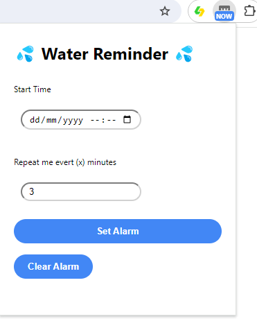

# Water Reminder Chrome Extension
This is chrome extensions uses the chrome.alarms API to schedule a preset time to remind the user to drink water by bring a alert notification if there on a page. A user will set when the alarms should first remind them and the interval for subsequent reminders
 
